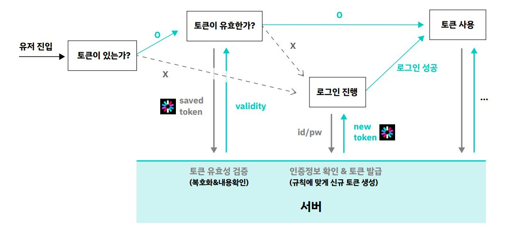

# Wanted Pre-onboarding 3월 FE 코스 2일차 실습

> 2일차 실습을 위한 스켈레톤 코드입니다. 강의를 듣고 설명에 따라 실습을 진행해보세요!

## 프로젝트 실행 방법

```bash
  # 패키지매니저를 변경하려면 yarn.lock을 삭제 후 npm install 등을 실행합니다.
  $ yarn && yarn dev
```

## 과제 수행 방법

아래의 파일들을 읽고 과제를 수행해 주세요. 실습 1은 2-1, 2는 2-2 폴더에 있습니다. login.js 내에는 각 실습별로 구현해야 하는 함수가 명시되어 있습니다.

- src/pages/2-1/JWTLogin.jsx
- src/pages/2-2/JWTLoginWithLocalStorage.jsx
- src/pages/2-2/AutoLogin.jsx
- src/api/login.js

# 강의 내용 복습하기

## 토큰(Token)이란?

사용자 신원을 알 수 있는 인증키,

`a piece of data that is used to represent and replace another one, in order to prevent private information being seen by someone who is not allowed to do so :`

## 로그인에 토큰을 사용해야하는 이유

서버는 무상태성(stateless)기 때문에 상태 저장을 하지 않기 때문에,
토큰을 사용해 사용자의 정보를 저장하기 위해

- 토큰을 사용하지 않는다면 물건을 장바구니에 추가할 때도, 장바구니로 이동할 때도 로그인을 계속해줘야함

## 로그인의 흐름


1. 클라이언트에서 서버로 로그인 요청

2. 서버에서 클라이언트에 토큰 발급 및 전달

3. 클라이언트에서 토큰 보관

4. 클라이언트에서 토큰을 사용해 서버에 요청

## 실제 서비스에서의 구조


유저 진입 후 토큰을 가지고 있는 여부에 따라 다음 단계 결정

    1-1. 토큰이 있는 경우 서버에 token의 유효성을 확인
      - 토큰이 유효하다면 로그인 성공!
      - 토큰이 유효하지 않다면 로그인 진행

    1-2. 토큰이 없다면 로그인 진행
      - 사용자의 id와 비밀번호를 받아 서버에 인증 정보를 확인하고, 서버에서 새로운 token을 발급받아서 로그인 성공!

## JWT (Json Web Token)

내부에 들어 있는 내용

1. Header
   - 암호화 규칙 (alg) : 암호화 알고리즘\_어떻게 암호화 할 것인지에 대한 내용
   - 토큰 타입 (typ)

```json
{
  "alg": "HS256",
  "typ": "JWT"
}
```

2. PAYLOAD
   - 데이터 (클레임)
   - sub: 토큰 제목
   - iat: 언제 발급되었는지

```json
{
  "sub": "1234567",
  "name": "John Doe",
  "iat": 1516239022
}
```

3. SIGNATURE
   - 암호화를 위한 데이터
   - MY_SECRET_KEY : 서버만 알고 있고, 서버와 비교하여 유효성 검사할 데이터

```json
HMACSHA256(
  base64UrlEncode(header) + "." +
  base64UrlEncode(payload),
  MY_SECRET_KEY_1234!@#
) secret base64 encoded
```

## 해싱이란?

- 단방향 암호화 기법
- 평문(암호화 되지 않은 정보)를 해시함수(해시 알고리즘)을 이용해 고정된 길이의 암호화된 문자열로 바꾸는 것

### 실제로 JWT 관련 동작이 일어나는 곳



- 토큰이 유효한지 확인할 때
  - 클라이언트가 저장된 token을 서버에 보내고, 서버는 유효성 검증을 한 결과를 클라이언트에게 반환
- 로그인 진행할 때
  - 사용자가 입력한 id와 비밀번호를 서버에 보내면, 서버는 인증 정보를 확인하고 새로운 token을 생성해서 클라이언트에 보내줌

### Access Token만 사용하면 보안이 완벽할까?

- XSS, CSRF 등을 통해 토큰을 탈취할 수 있음


### XSS (Cross Site Scripting)

- 관리자가 아닌 권한이 없는 사용자가 **웹 사이트에 스크립트를 삽입하는 공격 기법**
- 악의적인 사용자가 C&C 서버로 리다이렉션 하기 위해 리다이렉션 스크립트를 주입하여 중간 경유지로 활용
- 사용자의 쿠키를 탈취하여 세션 하이재킹(Session Hijacking) 공격을 수행


### CSRF (Cross-site Request Forgery)

- 사이트 간 요청 위조
- 사용자가 자신의 의지와는 무관하게 공격자가 의도한 행위를 특정 웹사이트에 요청하게 하는 공격
- 악성 메일이나, 스팸 문자의 링크를 클릭하면 사용자의 정보를 탈취하는 공격


## JWT 보관 방식과 보안

### Access Token : 재접근할 수 없는 런타임 메모리에 저장

### Refresh Token: HttpOnly Cookie로 발급

Refresh Token

- 새로운 토큰을 생성하는 용도로만 사용되는 token (일회용 토큰)

HttpOnly Cookie

- `https`로만 접근이 가능하고, javascript로는 접근이 불가능
- GET,POST (읽고 쓰기)가 모두 불가능
- API에 넣어서 사용해도 RESPONSE가 오지 않음


### XSS 공격 방어


- HTTPS 요청으로만 사용 가능하기 때문에 (자바스크립트 사용 불가) XSS 공격으로 토큰을 탈취할 수 없음
- 다른 방법으로 탈취하더라도 Token에 접근하기 위해서는 추가 인증이 필요함

### CSRF 공격 방어


1. CSRF 공격으로 Refresh Token 재사용 시도
2. 악성사이트에서 서버로 Access Token 재발급 요청

결과

- 만료되지 않은 Access Token 확인, 모든 토큰 무효화
- 일회용 Refresh Token으로 토큰 재발급 요청했기 때문에 요청을 무시 (Refresh Token Rotation)

---

## 로그인 기능 연결하기 1

[작성코드](src/pages/2-1/)

#### 1. 1일차에서 구성한 화면에 제공된 로그인 API 붙이기

#### 2. 로그인 API의 응답을 바로 사용해 유저 정보를 받아와 화면에 보여주기

```js
// login api

import { BASE_URL } from "./const.js";
import axios from "axios";

/*********
 *  실습 2-1
 * */

export const loginWithToken = async (args) => {
  const loginRes = await axios.post(`${BASE_URL}/auth/login`, args);

  if (loginRes)
    return { result: "success", access_token: loginRes.data.access_token };

  return {
    result: "fail",
    access_token: null,
  };
};

export const getCurrentUserInfoWithToken = async (token) => {
  const userInfoRes = await axios.get(`${BASE_URL}/profile`, {
    headers: { Authorization: `Bearer ${token}` },
  });
  if (userInfoRes) return userInfoRes.data;

  return null;
};
```

로그인 연결 및 화면에 출력하기

```js
import React, { useState } from "react";
import {
  getCurrentUserInfoWithToken,
  loginWithToken,
} from "../../api/login.js";

const JWTLogin = () => {
  const [userInfo, setUserInfo] = useState(null);

  const loginSubmitHandler = async (event) => {
    event.preventDefault();

    const formData = new FormData(event.currentTarget);

    const loginPayload = {
      username: formData.get("username"),
      password: formData.get("password"),
    };

    const loginResponse = await loginWithToken(loginPayload);
    if (loginResponse.result === "fail") return;

    // token 넘기기
    const userInfo = await getCurrentUserInfoWithToken(
      loginResponse.access_token
    );
    if (!userInfo) return;

    setUserInfo(userInfo);
  };

  return (
    <div>
      <h1>Login with JWT - in memory</h1>
      <form onSubmit={loginSubmitHandler}>
        <label>
          Username:
          <input type="text" name="username" />
        </label>
        <label>
          Password:
          <input type="password" name="password" />
        </label>
        <button type="submit" value="Submit">
          submit
        </button>
      </form>
      <div>
        <h2>User info</h2>
        {JSON.stringify(userInfo)}
      </div>
    </div>
  );
};

export default JWTLogin;
```

## 로그인 기능 연결하기 2

#### 1. 실습1에서 만든 로그인 로직에서 토큰을 반환하지 않고 로컬스토리지에 저장

#### 2. 로컬스토리지에 저장된 토큰을 가져와 유저 정보 조회

#### 3. 로그인 페이지가 아닌 다른 페이지에서 로컬 스토리지의 값을 이용해 로그인

```js
// login api

/*********
 *  실습 2-2
 * */

export const login = async (args) => {
  const loginRes = await axios.post(`${BASE_URL}/auth/login`, args);

  // token을 로컬스토리지에 저장
  if (loginRes) {
    saveAccessTokenToLocalStorage(loginRes.data.access_token);
    return "success";
  }

  return "fail";
};

export const getCurrentUserInfo = async () => {
  // 로컬스토리지에 저장된 token 가져와서 로그인하기
  const token = getAccessTokenFromLocalStorage();

  const userInfoResponse = await axios.get(`${BASE_URL}/profile`, {
    headers: {
      Authorization: `Bearer ${token}`,
    },
  });

  if (userInfoResponse) return userInfoResponse.data;

  return null;
};
```

#### 다른 페이지에서 로그인하기

isDataFetched로 첫 렌더될 때만 getUserInfo 함수 실행되도록 설정

```js
import React, { useCallback, useEffect, useRef, useState } from "react";
import { getCurrentUserInfo, login } from "../../api/login.js";

const AutoLogin = () => {
  const [userInfo, setUserInfo] = useState(null);
  const isDataFetched = useRef(false);

  const getUserInfo = useCallback(async () => {
    const userInfoResult = await getCurrentUserInfo();

    if (!userInfoResult) return;

    setUserInfo(userInfoResult);

    isDataFetched.current = true;
  }, []);

  useEffect(() => {
    if (isDataFetched.current) return;
    getUserInfo();
  }, []);

  return (
    <div>
      <h1>Another page</h1>
      <div>
        <h2>User info</h2>
        {JSON.stringify(userInfo)}
      </div>
    </div>
  );
};

export default AutoLogin;
```

## fetchClient 함수 만들어서 요청하기

```js
export const fetchClient = async (url, options) => {
  const accessToken = getAccessTokenFromLocalStorage();
  const newOptions = {
    ...options,
    headers: {
      ...options.headers,
      Authorization: `Bearer ${accessToken}`,
    },
  };
  return fetch(url, newOptions);
};
```

```js
export const getCurrentUserInfo = async ()=>{
  const userInfoRes = await fetchClient(
    url: `${ BASE_URL }/profile`,
    options: {method: 'GET'}
  )

  if(userInfoRes.ok){
    return userInfoRes.json()
  }
  return null
}
```

```js
// userInfo 가져오는 함수
export const getCurrentUserInfo = async ()=>{
  const userInfoRes = await fetchClient(
    url: `${ BASE_URL }/profile`,
    options: {method: 'GET'}
  )

  if(userInfoRes.ok){
    return userInfoRes.json()
  }
  return null
}
```

참고사이트

[https://noirstar.tistory.com/266](https://noirstar.tistory.com/266)
